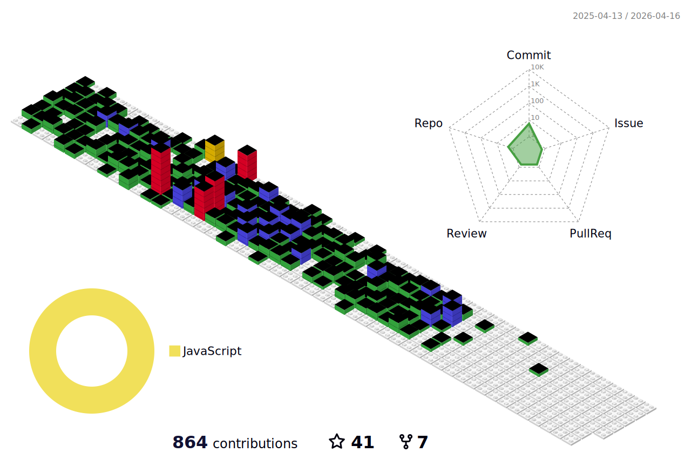

<!-- Banner -->

  

<h1 align="center">Hi, I'm Iqra Sarwar 👋</h1>

  <b>Software Engineer | Tech Enthusiast | Lifelong Learner</b>

  

---

## 🚀 About Me

- 🔭 Currently working on **React, Moodle, and PHP**
- 🤝 Open to collaborate on **Web Development** & **Data Engineering** projects
- 📚 2025 Goals: *Contribute to open source & read more self-help books*
- 💡 Passionate about learning new technologies and reading books

---

## 🛠️ Tech Stack

  
  
  
  
  
  
  
  
  
  
  
  
  
  
  
  
  
  
  

---

## 📊 GitHub Analytics

  
   
  

---

## 🖼️ Contribution Graph

  

---

## 🌐 Let's Connect

  
  
  
  
  

  

